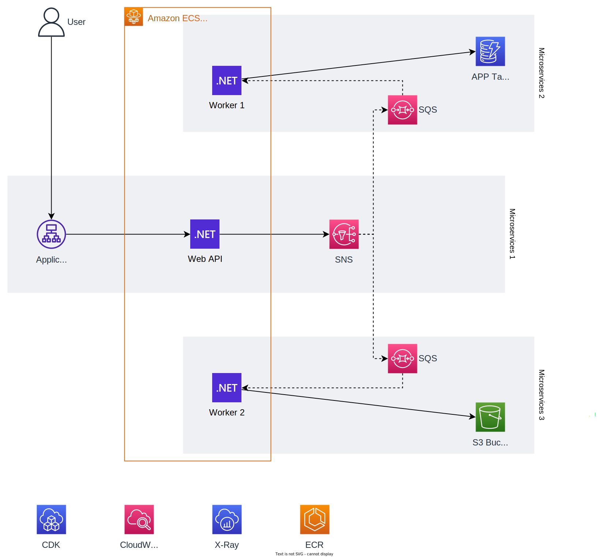
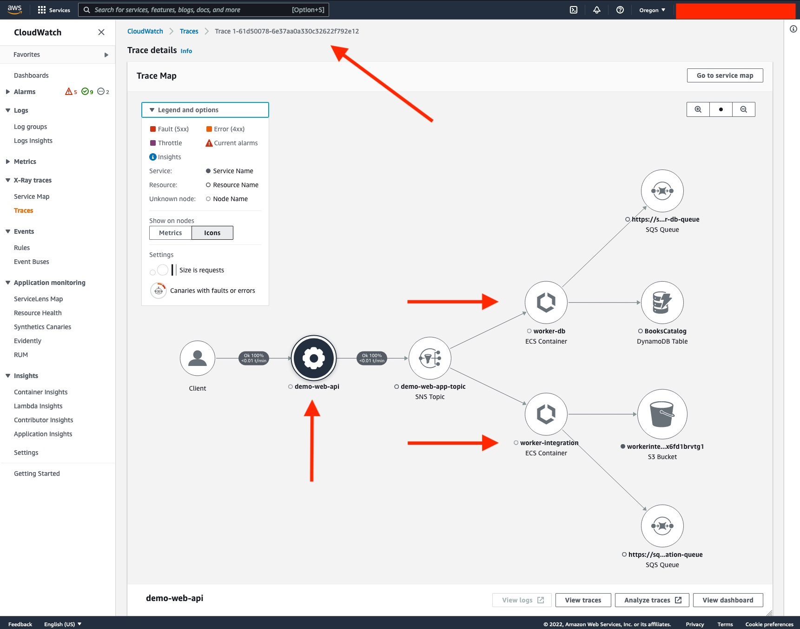

# Sample .NET8 Worker Services with AWS CDK and AWS Fargate

This repository contains a sample implementation of Fanout Architecture using .NET8 Worker Services to process messages from [Amazon Simple Notification Service (SNS)](https://aws.amazon.com/sns/) Topic and [Amazon Simple Queue Service (SQS)](https://aws.amazon.com/sqs/) Queue. Since the Worker Services would have no UI, to operate this solution, you need Observability implemented. In this repository, you can also find sample .NET Observability implementation using the combination of [AWS X-Ray](https://aws.amazon.com/xray/) and [Amazon CloudWatch](https://aws.amazon.com/cloudwatch/). To provision this solution, you can use [AWS Cloud Development Kit (AWS CDK)](https://aws.amazon.com/cdk/) to implement your modern Infrastructure as Code, using .NET C# to provision all AWS Resources your application needs.

## Architecture



**Componets:**

1. [.NET8 Web API Microservices](./WebAPI/README.md) - Demo Web API to simulate end-user requests.
1. [.NET8 Worker Service 1](./ServicesWorkerDb/README.md) - Demo Worker Services that persist on DynamoDB.
1. [.NET8 Worker Service 2](./ServicesWorkerIntegration/README.md) - Demo Worker Services that persist on S3.
1. [SNS](https://aws.amazon.com/sns/) - Fully managed pub/sub messaging for asynchronous processing.
1. [SQS](https://aws.amazon.com/sqs/) - Fully managed message queues for microservices.
1. [Amazon DynamoDb Table](https://docs.aws.amazon.com/amazondynamodb/latest/developerguide/Introduction.html) -  Fast, flexible NoSQL database service for single-digit millisecond performance at any scale.
1. [Amazon Simple Storage Service (Amazon S3) Bucket](https://aws.amazon.com/s3/) - Object storage built to retrieve any amount of data from anywhere.
1. [AWS X-Ray](https://aws.amazon.com/xray/) - Analyze and debug production, distributed applications.
1. [Amazon CloudWatch](https://aws.amazon.com/cloudwatch/) -  Observability of your AWS resources and applications on AWS.
1. [Amazon Elastic Container Registry (Amazon ECR)](https://aws.amazon.com/ecr/) - Easily store, share, and deploy your container software anywhere.
1. [AWS CDK](https://aws.amazon.com/cdk/) -
Define cloud infrastructure using familiar programming languages [(C#)](./WebAPI/src/infra/README.md)

## Guide to deploy and test the sample

### Prerequisites

Before exploring the code, please ensure you have the following tools to deploy and see the demo working.

* [_.NET 8_](https://dotnet.microsoft.com/en-us/download/dotnet/8.0)
* [_Git CLI_](https://git-scm.com/book/en/v2/Getting-Started-Installing-Git)
* [_AWS CLI_](https://docs.aws.amazon.com/cli/latest/userguide/getting-started-install.html)
* [_AWS CDK v2_](https://docs.aws.amazon.com/cdk/v2/guide/cli.html)
* [_Docker_](https://docs.docker.com/engine/install/)
* [_VSCode_ _(or your preferred IDE)_](https://code.visualstudio.com/)

### **Deployment Script**

This path is for those not interested in the details of the steps executed to deploy the solution. You can run the script as instructed below and jump into the test.

For: [Bash]

```bash
./deploy.sh
```

For: [Powershel]

```PowerShell
.\deploy.ps1
```

After completing the deployment, you can copy the printed URL like <http://WebAp-demos-XXXXXXXXXXXX-9999999999.us-west-2.elb.amazonaws.com> and jump to test


## Test the Solution

To begin the tests, copy the URL printed by the deployment script. It will look like: “http://WebAp-demos-XXXXXXXX-99999999.us-west-2.elb.amazonaws.com”. Make a POST request to the endpoint http://YOUR_ALB_URL/api/Books using your favorite REST API Client, sending the following JSON payload. You can send multiple requests to have some sample data to visualize the Observability result from AWS CloudWatch console.

```json
{
    "Year" : 2022,
    "Title": "Demo book payload",
    "ISBN": "12345612",
    "Authors": ["Author1", "Author2"],
    "CoverPage": "picture1.jpg"
}
```

### .NET Observability with X-Ray and CloudWatch

To see the results, open the AWS Console and navigate to CloudWatch and select the option Traces from the left navigation menu, then go to the end of the page use one of the Trace ID you got from the POST Result you should see a picture like the one bellow.



## Clean up Resources

After exploring this solution, please remember to clean up, here's the script to help clean up.

Using: [Bash]

```bash
./clean.sh
```

Using: [PowerShell]

```PowerShell
.\clean.ps1
```

## Security

See [CONTRIBUTING](CONTRIBUTING.md#security-issue-notifications) for more information.

## License

This library is licensed under the MIT-0 License. See the LICENSE file.
