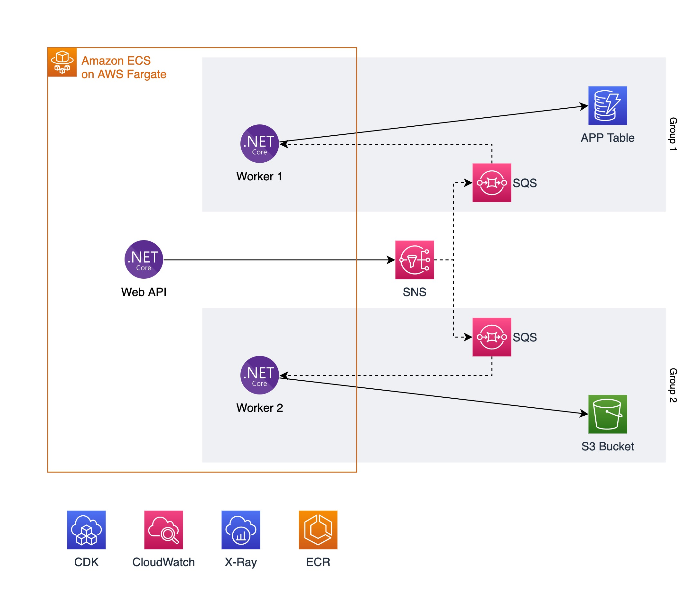

# Sample .NET6 Worker Services with AWS CDK and AWS Fargate

This repository contains a sample implementation of Fanout Architecture using .NET6 Worker Services to process messages from Amazon SNS Topic and Amazon SQS Queue. Since the Worker Services would have no UI, to operate this solution, you need Observability implemented. In this repository, you can also find sample .NET Observability implementation using the combination of AWS X-Ray and Amazon CloudWatch. To provision this solution, you can use AWS CDK to implement your modern Infrastructure as Code, using .NET C# to provision all AWS Resources your application needs.

## Architecture



**Componets:**

1. [.NET6 Web API Microservices](./WebAPI/README.md) - Demo Web API to simulate end-user requests.
1. [.NET6 Worker Service 1](./ServicesWorkerDb/README.md) - Demo Worker Services that persist on DynamoDB.
1. [.NET6 Worker Service 2](./ServicesWorkerIntegration/README.md) - Demo Worker Services that persist on S3.
1. [Amazon SNS](https://aws.amazon.com/sns/) - Fully managed pub/sub messaging for asynchronous processing.
1. [Amazon SQS](https://aws.amazon.com/sqs/) - Fully managed message queues for microservices.
1. [Amazon DynamoDb Table](https://docs.aws.amazon.com/amazondynamodb/latest/developerguide/Introduction.html) -  Fast, flexible NoSQL database service for single-digit millisecond performance at any scale.
1. [S3 Bucket](https://aws.amazon.com/s3/) - Object storage built to retrieve any amount of data from anywhere.
1. [AWS X-Ray](https://aws.amazon.com/xray/) - Analyze and debug production, distributed applications.
1. [Amazon CloudWatch](https://aws.amazon.com/cloudwatch/) -  Observability of your AWS resources and applications on AWS.
1. [Amazon ECR](https://aws.amazon.com/ecr/) - Easily store, share, and deploy your container software anywhere.
1. [AWS CDK](https://aws.amazon.com/cdk/) -
Define cloud infrastructure using familiar programming languages [(C#)](./WebAPI/src/infra/README.md)

## Guide to deploy and test the sample

### Prerequisites

Before exploring the code, please ensure you have the following tools to deploy and see the demo working.

* [_.NET 6_](https://dotnet.microsoft.com/en-us/download/dotnet/6.0)
* [_Git CLI_](https://git-scm.com/book/en/v2/Getting-Started-Installing-Git)
* [_AWS CLI_](https://docs.aws.amazon.com/cli/latest/userguide/getting-started-install.html)
* [_AWS CDK v2_](https://docs.aws.amazon.com/cdk/v2/guide/cli.html)
* [_Docker_](https://docs.docker.com/engine/install/)
* [_VSCode_ _(or your preferred IDE)_](https://code.visualstudio.com/)

This repository contains two paths for deployment: **[Script deployment](#script-deployment)** and **[Step-by-step deployment](#step-by-step-deployment)**"

### **Script deployment**

This path is for those not interested in the details of the steps executed to deploy the solution. You can run the script as instructed below and jump into the test.

For: [Linux & MacOS]
```bash
./deploy.sh
```

For: [Windows]

```PowerShell
.\deploy.ps1
```

After completing the deployment, you can copy the printed URL like <http://WebAp-demos-XXXXXXXXXXXX-9999999999.us-west-2.elb.amazonaws.com> and jumpt to test

### **Step-by-Step deployment**

This path is for those who want to execute step-by-step to learn and see each step's results before continuing to the topic [**Test the Solution**](#test-the-solution).

Run the following commands:

#### Deploy WebAPI microservice

```bash
cd WebAPI/src/infra/ 
cdk bootstrap 
cdk synth 
cdk deploy
export DEMO_VPC_ID=$(aws cloudformation describe-stacks  --stack-name WebAppInfraStack --output text --query 'Stacks[0].Outputs[?OutputKey==`DemoVpcId`].OutputValue  | [0]') 
cd -
```

This is what you just did:

1. Navigated to the CDK project folder for the WebAPI;
2. Bootstrap your environment, account, and region to run the CDK project;
3. Synthesize the project to validate the implementation and produce the CloudFormation template to be deployed;
4. Deploy the CloudFormation Stack after your confirmation;
5. Query the VPC ID created from the first Stack and export it to a local environment variable DEMO_VPC_ID
6. Navigated back to the root folder

#### Deploy the first Worker Services that persist on DynamoDb Table

Run the following commands:

```bash
cd ServicesWorkerDb/src/infra/ 
cdk synth
cdk deploy
cd -
```

This is what you just did:

1. Navigated to the CDK project folder for the Worker Service that persists into DynamoDB
2. Then synthesize
3. and deploy the Stack.
4. Navigated back to the root folder

#### Deploy the second Worker Services that persist on S3 Bucket

Run the following commands:

```bash
cd ServicesWorkerIntegration/src/infra/
cdk synth
cdk deploy
cd -
```

This is what you just did:

1. Navigated to the CDK project folder for the Worker Service that persists into S3 Bucket
2. Then synthesize
3. and deploy the Stack.
4. Navigated back to the root folder

#### Print the URL for testing

```bash
aws cloudformation describe-stacks  --stack-name WebAppInfraStack --output text --query 'Stacks[0].Outputs[?contains(OutputKey,`demoserviceServiceURL`)].OutputValue  | [0]'
```

1. This command will show the URL you'll use for testing.

## Test the Solution

[TODO: add guide]

### .NET Observability with X-Ray and CloudWatch

[TODO: Add Observability details]

## Clean up Resources

After exploring this solution, please remember to clean up, here's the script to help cleaning up.

* Note: if your are using windows, you can run .sh scripts using [Git Bash](https://git-scm.com/downloads)

For: [Linux & MacOS]

```bash
./clean.sh
```

For: [Windows]

```PowerShell
.\clean.ps1
```

## Related content

[TODO: add guide]

To learn more about this implementation see the following contents

## Security

See [CONTRIBUTING](CONTRIBUTING.md#security-issue-notifications) for more information.

## License

This library is licensed under the MIT-0 License. See the LICENSE file.
